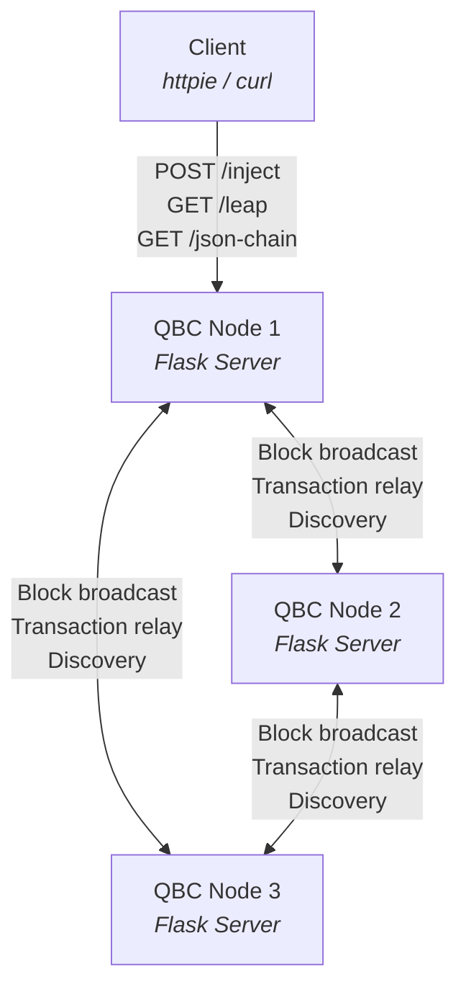
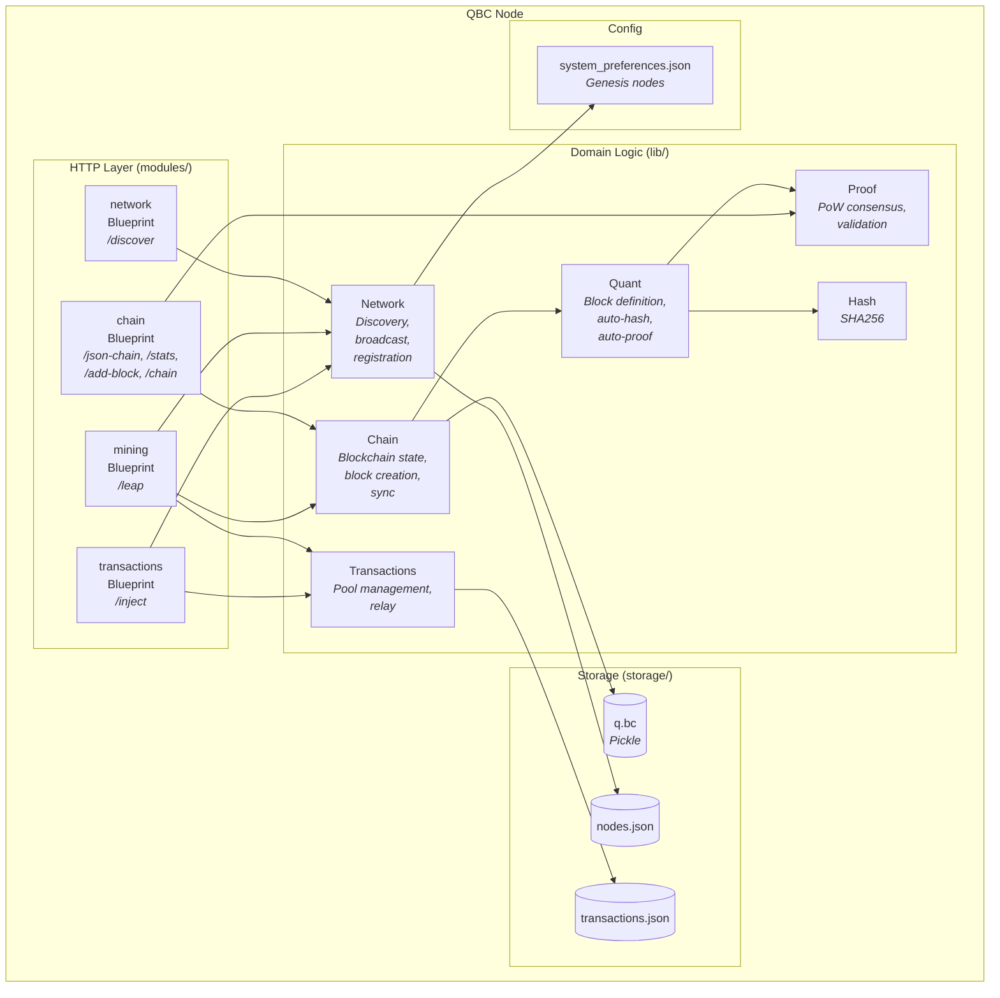
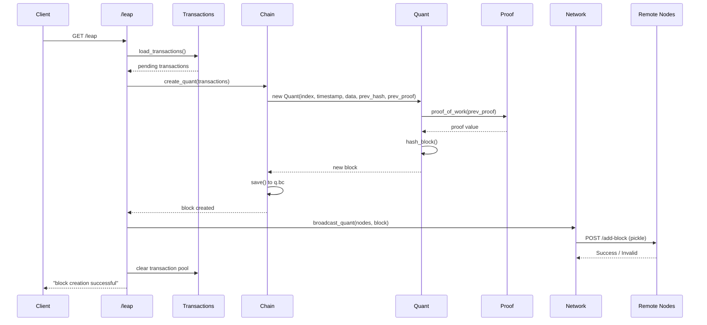
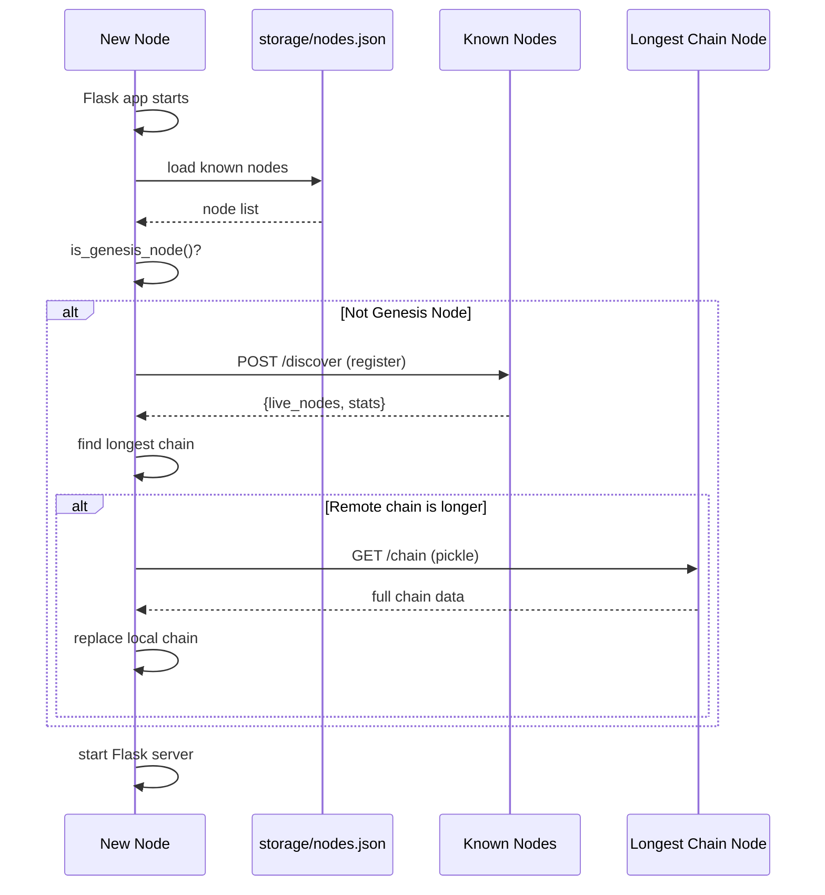
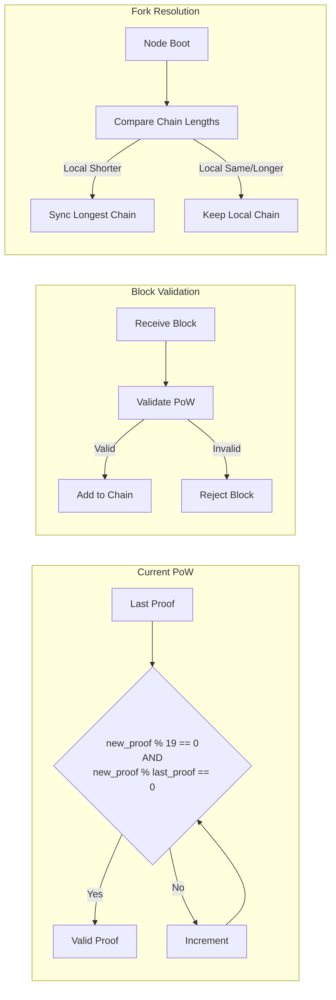

# Architecture Diagrams

## System Context

```mermaid
graph TB
    Client["Client<br/><i>httpie / curl</i>"]

    Node1["QBC Node 1<br/><i>Flask Server</i>"]
    Node2["QBC Node 2<br/><i>Flask Server</i>"]
    Node3["QBC Node 3<br/><i>Flask Server</i>"]

    Client -->|"POST /inject<br/>GET /leap<br/>GET /json-chain"| Node1

    Node1 <-->|"Block broadcast<br/>Transaction relay<br/>Discovery"| Node2
    Node1 <-->|"Block broadcast<br/>Transaction relay<br/>Discovery"| Node3
    Node2 <-->|"Block broadcast<br/>Transaction relay<br/>Discovery"| Node3
```

## Container Diagram

```mermaid
graph TB
    subgraph "QBC Node"
        subgraph "HTTP Layer (modules/)"
            TX["transactions<br/>Blueprint<br/><i>/inject</i>"]
            MINE["mining<br/>Blueprint<br/><i>/leap</i>"]
            CHAIN["chain<br/>Blueprint<br/><i>/json-chain, /stats,<br/>/add-block, /chain</i>"]
            NET["network<br/>Blueprint<br/><i>/discover</i>"]
        end

        subgraph "Domain Logic (lib/)"
            ChainLib["Chain<br/><i>Blockchain state,<br/>block creation,<br/>sync</i>"]
            QuantLib["Quant<br/><i>Block definition,<br/>auto-hash,<br/>auto-proof</i>"]
            ProofLib["Proof<br/><i>PoW consensus,<br/>validation</i>"]
            NetworkLib["Network<br/><i>Discovery,<br/>broadcast,<br/>registration</i>"]
            TxLib["Transactions<br/><i>Pool management,<br/>relay</i>"]
            HashLib["Hash<br/><i>SHA256</i>"]
        end

        subgraph "Storage (storage/)"
            QBC_FILE[("q.bc<br/><i>Pickle</i>")]
            NODES_FILE[("nodes.json")]
            TX_FILE[("transactions.json")]
        end

        subgraph "Config"
            GENESIS["system_preferences.json<br/><i>Genesis nodes</i>"]
        end
    end

    TX --> TxLib
    TX --> NetworkLib
    MINE --> ChainLib
    MINE --> TxLib
    MINE --> NetworkLib
    CHAIN --> ChainLib
    CHAIN --> ProofLib
    NET --> NetworkLib

    ChainLib --> QuantLib
    QuantLib --> ProofLib
    QuantLib --> HashLib

    ChainLib --> QBC_FILE
    NetworkLib --> NODES_FILE
    TxLib --> TX_FILE
    NetworkLib --> GENESIS
```

## Sequence: Mining a Block

```mermaid
sequenceDiagram
    participant C as Client
    participant M as /leap
    participant T as Transactions
    participant Ch as Chain
    participant Q as Quant
    participant P as Proof
    participant N as Network
    participant R as Remote Nodes

    C->>M: GET /leap
    M->>T: load_transactions()
    T-->>M: pending transactions
    M->>Ch: create_quant(transactions)
    Ch->>Q: new Quant(index, timestamp, data, prev_hash, prev_proof)
    Q->>P: proof_of_work(prev_proof)
    P-->>Q: proof value
    Q->>Q: hash_block()
    Q-->>Ch: new block
    Ch->>Ch: save() to q.bc
    Ch-->>M: block created
    M->>N: broadcast_quant(nodes, block)
    N->>R: POST /add-block (pickle)
    R-->>N: Success / Invalid
    M->>T: clear transaction pool
    M-->>C: "block creation successful"
```

## Sequence: Node Bootstrap

```mermaid
sequenceDiagram
    participant N as New Node
    participant D as storage/nodes.json
    participant K as Known Nodes
    participant L as Longest Chain Node

    N->>N: Flask app starts
    N->>D: load known nodes
    D-->>N: node list
    N->>N: is_genesis_node()?

    alt Not Genesis Node
        N->>K: POST /discover (register)
        K-->>N: {live_nodes, stats}
        N->>N: find longest chain

        alt Remote chain is longer
            N->>L: GET /chain (pickle)
            L-->>N: full chain data
            N->>N: replace local chain
        end
    end

    N->>N: start Flask server
```

## Consensus Architecture (Override Domain)

```mermaid
graph LR
    subgraph "Current PoW"
        LP[Last Proof] --> CHECK{new_proof % 19 == 0<br/>AND<br/>new_proof % last_proof == 0}
        CHECK -->|Yes| VALID[Valid Proof]
        CHECK -->|No| INC[Increment] --> CHECK
    end

    subgraph "Block Validation"
        RECV[Receive Block] --> VALPOW[Validate PoW]
        VALPOW -->|Valid| ADD[Add to Chain]
        VALPOW -->|Invalid| REJECT[Reject Block]
    end

    subgraph "Fork Resolution"
        BOOT[Node Boot] --> COMPARE[Compare Chain Lengths]
        COMPARE -->|Local Shorter| SYNC[Sync Longest Chain]
        COMPARE -->|Local Same/Longer| KEEP[Keep Local Chain]
    end
```
