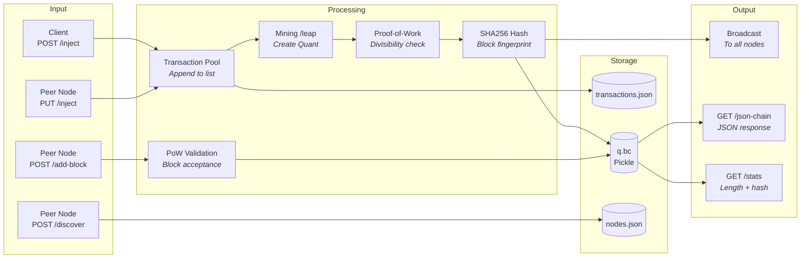

# Data Flow Map

## Data Input Sources

| Source | Type | Data Format | Validation | Evidence |
|--------|------|-------------|------------|----------|
| POST /inject | API | Form-encoded (`data=JSON`) | None | modules/transactions/controllers.py |
| PUT /inject | Node relay | Form-encoded (`data=JSON`) | None | modules/transactions/controllers.py |
| POST /add-block | Node broadcast | Pickle binary | PoW check only | modules/chain/controllers.py |
| POST /discover | Node registration | Form-encoded (`host=URL`) | None | modules/network/controllers.py |
| GET /chain | Chain sync | Pickle binary | None (longest chain rule) | lib/network.py |

## Data Flow Diagram

## Data Storage

| Data Type | Store | Format | Retention | Evidence |
|-----------|-------|--------|-----------|----------|
| Blockchain | storage/q.bc | Pickle (binary) | Permanent | lib/chain.py:save() |
| Node registry | storage/nodes.json | JSON array | Session (rebuilt on discovery) | lib/network.py:save_nodes() |
| Transaction pool | storage/transactions.json | JSON array | Until mined (cleared on /leap) | lib/transactions.py |
| Genesis config | config/system_preferences.json | JSON | Static config | lib/qbc_utils.py |

## Data Lifecycle: Transaction

### Creation
- **Trigger**: Client POST /inject or peer PUT /inject
- **Location**: modules/transactions/controllers.py
- **Validations**: None

### Processing
- **Mining**: GET /leap loads all pending transactions, bundles into new Quant
- **Location**: modules/mining/controllers.py

### Storage
- **Pending**: Written to transactions.json as JSON array
- **Mined**: Embedded in Quant.data, serialized to q.bc as pickle
- **Location**: lib/chain.py:create_quant()

### Deletion
- **Trigger**: Block mined (GET /leap)
- **Behavior**: Transaction pool cleared completely
- **Location**: modules/mining/controllers.py (saves empty list)

## Data Lifecycle: Block (Quant)

### Creation
- **Trigger**: GET /leap (mining)
- **Components**: index, timestamp, transaction data, previous_hash, proof
- **Location**: lib/quant.py, lib/chain.py:create_quant()

### Propagation
- **Broadcast**: Pickle-serialized POST to /add-block on all known nodes
- **Location**: lib/network.py:broadcast_quant()

### Validation (on receiving node)
- **Check**: PoW validation only (no hash chain verification)
- **Location**: modules/chain/controllers.py, lib/proof.py:validate()

### Persistence
- **Format**: Pickle serialization of entire Chain object
- **Location**: lib/chain.py:save() -> storage/q.bc
